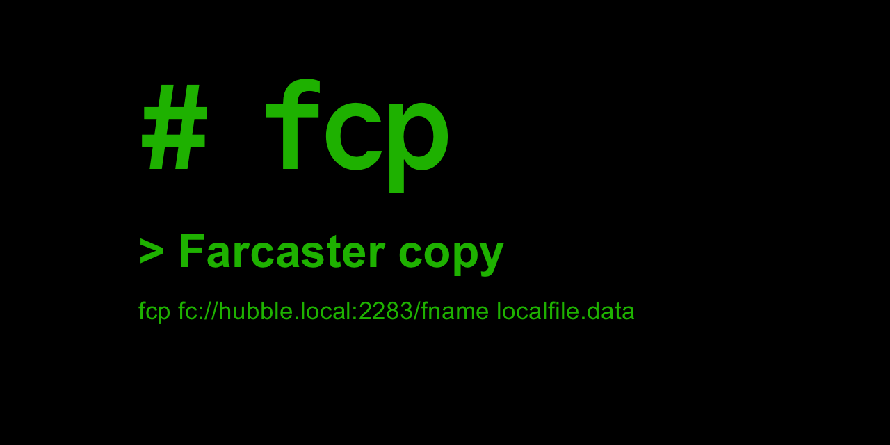

# fcp

Copy data from/to a farcaster hub

## Install

- Binaries: [pre-built binaries](https://github.com/vrypan/fcp/releases)
- From source: Clone the repo, and run `make`. Copy the generated binaries `fcp` and `fcp-inspect` to a location in your $PATH.
- macOS/Homebrew:
  ```
  brew install vrypan/tap/fcp
  ```

> [!WARNING]
> The homebrew tap has changed since v1.1.2. If you have alread installed a version <=1.1.1 do
> ```
> brew uninstall fcp
> brew untap vrypan/fcp
> brew tap vrypan/tap
> brew install vrypan/tap/fcp

## Use

- `fcp --help` to see all options.

- Copy fname's casts, reactions and links from your hub to a local file:
  ```
  fcp fc://hub.local:3383/fname localfile.data
  ```

- Upload the local file to your hub:
  ```
  fcp localfile.data fc://hub.local:3383
  ```
(It will fail, because the messages already exist in the hub)

- Use fc+ssl if the hub is using SSL:
  ```
  fcp fc+ssl://hub.local:3383/fname localfile.data
  ```

- Re-sign messages with a new signer before uploading:
  ```
  fcp local.data fc+ssl://hub.local:3383/fname --app-key=0x...
  ```

### Examining local files

The files generated by `fcp` are binary files containing the marshaled
protobuf responses from the hub.

- Convert to json:
  ```
  fcp-inspect localfile.data
  ```
- Print out only stats about the file:
  ```
  fcp-inspect localfile.data --stats
  ```
